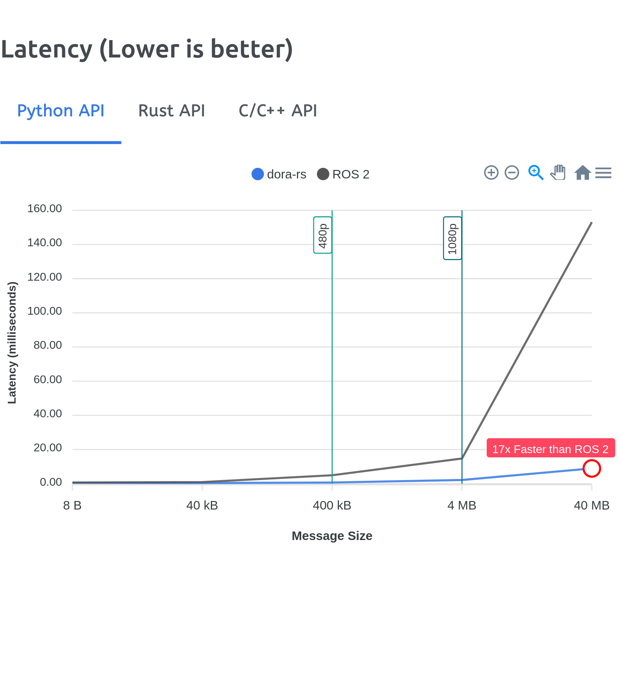

<p align="center">
    
</p>

<h2 align="center">
  <a href="https://www.dora-rs.ai">Website</a>
  |
  <a href="https://www.dora-rs.ai/docs/api/python-api">Python API</a>
  -
  <a href="https://docs.rs/dora-node-api/latest/dora_node_api/">Rust API</a>
  |
  <a href="https://www.dora-rs.ai/docs/guides/">Guide</a>
  |
  <a href="https://discord.gg/6eMGGutkfE">Discord</a>
</h2>

<div align="center">
  <a href="https://github.com/dora-rs/dora/actions">
    
  </a>
  <a href="https://crates.io/crates/dora-rs">
    
  </a>
  <a href="https://docs.rs/dora-node-api/latest/dora_node_api/">
    
  </a>
  <a href="https://pypi.org/project/dora-rs/">
    
  </a>
</div>

---

# What is dora-rs?

Dataflow-Oriented Robotic Architecture (dora-rs) is a framework that makes creation of robotic applications fast and simple.

Building a robotic application can be summed up as bringing together hardwares, algorithms, and AI models, and make them communicate with each others. At dora-rs, we try to:

- make integration of hardware and software easy by supporting Python, C, C++, and also ROS2.
- make communication low latency by using zero-copy Arrow messages.

dora-rs is still experimental and you might experience bugs, but we're working very hard to make it stable as possible.

## Performance

dora-rs can show impressive performance, up to 17x faster compared to current status quo ROS2 in Python! This is the result of using our own shared memory server and Apache Arrow to achieve zero copy data passing.

<a href="https://www.dora-rs.ai/">

</a>

> See: https://github.com/dora-rs/dora-benchmark/tree/main for reproduction.

## Dataflow Paradigm

dora-rs implements a declarative dataflow paradigm where tasks are split between nodes isolated as individual processes.

Each node defines its inputs and outputs to connect with other nodes.

```yaml
nodes:
  - id: camera
    build: pip install ../../node-hub/opencv-video-capture
    path: opencv-video-capture
    inputs:
      tick: dora/timer/millis/20
    outputs:
      - image
    env:
      CAPTURE_PATH: 0
      IMAGE_WIDTH: 640
      IMAGE_HEIGHT: 480

  - id: object-detection
    build: pip install ../../node-hub/dora-yolo
    path: dora-yolo
    inputs:
      image:
        source: camera/image
        queue_size: 1
    outputs:
      - bbox
    env:
      MODEL: yolov8n.pt

  - id: plot
    build: pip install ../../node-hub/opencv-plot
    path: opencv-plot
    inputs:
      image:
        source: camera/image
        queue_size: 1
      bbox: object-detection/bbox
```

The dataflow paradigm has the advantage of creating an abstraction layer that makes robotic applications modular and easily configurable.

<a href="https://www.dora-rs.ai/">

</a>

## Communication

Communication between nodes is handled with shared memory on a same machine and TCP on distributed machines. Our shared memory implementation tracks messages across processes and discards them when obsolete. Shared memory slots are cached to avoid new memory allocation.

## Message Format

Nodes communicate with Apache Arrow Data Format.

[Apache Arrow](https://github.com/apache/arrow-rs) is a universal memory format for flat and hierarchical data. The Arrow memory format supports zero-copy reads for lightning-fast data access without serialization overhead. It defines a C data interface without any build-time or link-time dependency requirement, that means that dora-rs has **no compilation step** beyond the native compiler of your favourite language.


## Opentelemetry

dora-rs uses Opentelemetry to record all your logs, metrics and traces. This means that the data and telemetry can be linked using a shared abstraction.

[Opentelemetry](https://opentelemetry.io/) is an open source observability standard that makes dora-rs telemetry collectable by most backends such as elasticsearch, prometheus, Datadog..

Opentelemetry is language independent, backend agnostic, and easily collect distributed data, making it perfect for dora-rs applications.


## Hot-Reloading

dora-rs implements Hot-Reloading for python which means you can change code at runtime in Python while keeping your state intact.

Using the feature flag: `--attach --hot-reload`, dora-rs watch for code change and reload nodes that has been modified.
You can check fail-safe mechanism at: https://github.com/dora-rs/dora/pull/239

<a href="http://www.youtube.com/watch?v=NvvTEP8Jak8">

</a>

## Self-Coding Robot: Code RAG (WIP)

You can easily create a self-coding robot, by combining Hot-reloading with a Retrieval Augmented Generation (RAG) that is going to generate code modification from your prompt.
See:[examples/python-operator-dataflow](examples/python-operator-dataflow)


Self-Coding Robot is just the tip of the iceberg of robotics combined with llm, that we hope to power. There is so much more that we haven't explored yet like:

- [self-debugging](https://arxiv.org/pdf/2304.05128.pdf)
- [memory](https://github.com/cpacker/MemGPT)
- [function calling](https://github.com/ShishirPatil/gorilla)
- ...

## Installation

Quickest way:

```bash
cargo install dora-cli --locked

dora --help
```

On Unix system, you can install dora without cargo with:

```bash
curl --proto '=https' --tlsv1.2 -sSf https://raw.githubusercontent.com/dora-rs/dora/main/install.sh | bash

dora --help
```

For more info on installation, check out [our guide](https://www.dora-rs.ai/docs/guides/Installation/installing).

## Getting Started

1. Run the example:

```bash
git clone https://github.com/dora-rs/dora
cd examples/python-dataflow
dora build dataflow.yml
```

2. Get some example operators:

```bash
dora up
dora start dataflow.yml
```

> Make sure to have a webcam

To stop your dataflow, you can use <kbd>ctrl</kbd>+<kbd>c</kbd>

To go further, you can add a yolov8 operator, check out our getting started here: https://www.dora-rs.ai/docs/guides/getting-started/yolov8/

## ROS2 Bridge

- Compilation Free Message passing to ROS 2
- Automatic conversion ROS 2 Message <-> Arrow Array

```python
import random
import pyarrow as pa

# Configuration Boilerplate...
turtle_twist_writer = ...

## Arrow Based ROS2 Twist Message
## which does not require ROS2 import
message = pa.array([{
            "linear": {
                "x": 1,
            },
            "angular": {
                "z": 1
            },
        }])

turtle_twist_writer.publish(message)
```

> You might want to use ChatGPT to write the Arrow Formatting: https://chat.openai.com/share/4eec1c6d-dbd2-46dc-b6cd-310d2895ba15

## Hardwares

Cool hardware that we think might be good fit to try out dora-rs 🙋 We are not sponsored by manufacturers:

|                                   | Price | Open Source        | Github                                               | type       | Dora Project                                            |
| --------------------------------- | ----- | ------------------ | ---------------------------------------------------- | ---------- | ------------------------------------------------------- |
| DJI Robomaster S1                 | 550$  | SDK                | https://github.com/dji-sdk/RoboMaster-SDK            | Rover      | https://huggingface.co/datasets/dora-rs/dora-robomaster |
| DJI Robomaster EP Core            | 950$  | SDK                | https://github.com/dji-sdk/RoboMaster-SDK            | Rover, Arm |                                                         |
| DJI Tello                         | 100$  |                    |                                                      | Drone      |                                                         |
| BitCraze Crazyflies               | 225$  | Firmware, Lib, SDK | https://github.com/bitcraze                          | Drone      |                                                         |
| AlexanderKoch-Koch/low_cost_robot | 250$  | Everything         | https://github.com/AlexanderKoch-Koch/low_cost_robot | Arm        |                                                         |
| xArm 1S                           | 200$  |                    |                                                      | Arm        |                                                         |
| Wavego                            | 250$  |                    |                                                      | Quadruplet |                                                         |
| AINex                             | 800$  |                    |                                                      | Humanoid   |                                                         |

> For more: https://docs.google.com/spreadsheets/d/1YYeW2jfOIWDVgdEgqnMvltonHquQ7K8OZCrnJRELL6o/edit#gid=0

## Documentation

The full documentation is available on [our website](https://www.dora-rs.ai)

## Discussions

Our main communication channels are:

- [Our Discord server](https://discord.gg/6eMGGutkfE)
- [Our Github Project Discussion](https://github.com/orgs/dora-rs/discussions)

Feel free to reach out on any topic, issues or ideas.

We also have [a contributing guide](CONTRIBUTING.md).

## Support Matrix

|                                   | dora-rs                                                   | Hoped for                                                                                                                                |
| --------------------------------- | --------------------------------------------------------- | ---------------------------------------------------------------------------------------------------------------------------------------- |
| **Tier 1 Support**                | Python, Rust                                              | C, C++, ROS 2                                                                                                                            |
| **Tier 2 Support**                | C, C++, ROS2                                              |
| **Hot-reloading**                 | Python                                                    | Rust (https://github.com/orgs/dora-rs/discussions/360)                                                                                   |
| **Message Format**                | Arrow                                                     | Native                                                                                                                                   |
| **Local Communication**           | Shared Memory                                             | Custom Middleware, [zero-copy GPU IPC](https://arrow.apache.org/docs/python/api/cuda.html), intra-process `tokio::channel` communication |
| **Remote Communication**          | TCP (See: https://github.com/dora-rs/dora/issues/459)     | Custom Middleware, [Zenoh](https://zenoh.io/)                                                                                            |
| **Metrics, Tracing, and Logging** | Opentelemetry                                             | Native logging libraries into Opentelemetry                                                                                              |
| **Data archives**                 | Parquet ([dora-record](libraries/extensions/dora-record)) |
| **Visualization and annotation**  | OpenCV                                                    | [rerun.io](rerun.io)                                                                                                                     |
| **Supported Platforms (x86)**     | Windows, macOS, Linux                                     |
| **Supported Platforms (ARM)**     | macOS, Linux                                              |
| **Configuration**                 | YAML                                                      |

### Unstable functionality

`dora-rs` Ros2 Bridge is marked as **unstable**.
There are a number of reasons functionality may be marked as unstable:

- We are unsure about the exact API. The name, function signature, or implementation are likely to change in the future.
- The functionality is not tested extensively yet. Bugs may pop up when used in real-world scenarios.
- The functionality does not integrate well with the full dora-rs API. You may find it works in one context but not in another.

Releasing functionality as unstable allows us to gather important feedback from users that use dora-rs in real-world scenarios.
This helps us fine-tune things before giving it the final stamp of approval.
Users are only interested in solid, well-tested functionality can avoid this part of the API.

Functionality marked as unstable may change at any point without it being considered a breaking change.

## License

This project is licensed under Apache-2.0. Check out [NOTICE.md](NOTICE.md) for more information.
