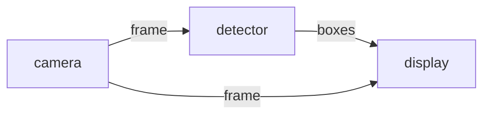
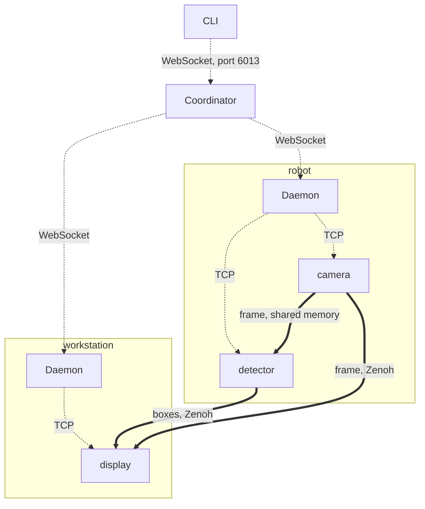

# dora 1.0

dora 1.0 is out. Starting with this release, the wire format and the public node APIs are frozen for the whole 1.x series: a node written against 1.0 will keep building, and keep talking to a dora daemon, until there is a 2.0.

```bash
cargo install dora-cli        # or: pip install dora-rs-cli
pip install dora-rs
```

This post is for two kinds of reader. If you have not used dora before, the next sections explain what it is, how it is put together, and what writing a node looks like. If you already run dora 0.x, the one thing to know before anything else is that 1.0 does not interoperate with 0.x at all. Skip ahead to [Upgrading from 0.x](#upgrading-from-0x) and keep the [migration guide](../migration-from-0.x.md) open while you update.

## What dora is

dora is a framework for building robotics and AI applications out of small programs that pass data to each other. You describe the application as a graph in a YAML file, write each node in Rust, Python, C or C++, and dora starts the processes, connects them, moves data between them, and restarts the ones that crash if you ask it to.

```yaml
nodes:
  - id: camera
    path: camera.py
    outputs: [frame]

  - id: detector
    build: cargo build -p detector --release
    path: target/release/detector
    inputs:
      frame: camera/frame
    outputs: [boxes]

  - id: display
    path: display.py
    inputs:
      boxes: detector/boxes
      frame: camera/frame
```

Each `inputs:` entry names the node and output it subscribes to, so the file above describes this graph:



```bash
dora run dataflow.yml
```

That is the whole setup: `dora run` runs each node's `build:` command, then starts the processes. There is no message definition language, no code generation step and no workspace to source. A Python node is a Python script; a Rust node is a binary.

The natural comparison is ROS 2, and the most concrete difference is latency. On the same Python workload, node-to-node latency in dora is 10–17x lower than with rclpy. The benchmark behind that number is in the repository ([`examples/ros2-comparison/`](../../examples/ros2-comparison/)); it runs identical Python senders and receivers on both frameworks, so it measures framework overhead rather than language speed. The gap comes from three design decisions.

### Apache Arrow, everywhere

Every message in dora is an Apache Arrow array, in memory, in every language binding. A Python node builds a `pyarrow` array and the Rust node downstream receives an `arrow` array over the same bytes. Nothing was encoded on the way out or decoded on the way in, so sending data between two languages costs the same as sending it within one.

A useful side effect is that messages are already in a format the rest of the data ecosystem reads. A frame or a point cloud that arrives as Arrow goes straight into numpy, pandas, polars or DuckDB.

### Shared memory above 4 KB

Messages of 4 KB and more are published through Zenoh shared memory, from one node directly to the next, without passing through the daemon. The receiver maps the pages the sender wrote, so nobody copies the payload, and latency stays roughly flat from 4 KB up to the 4 MB frames the benchmark tops out at.

Below 4 KB the message is copied into a heap buffer instead. Shared memory works in whole pages, and for a small message the cost of setting up a shared page is higher than the copy it would save. The threshold sits where the two costs cross on a 4 KiB page, and can be changed with `DORA_ZERO_COPY_THRESHOLD`.

### A Rust core

The daemon, the coordinator, the CLI and everything on the routing path are Rust. Python nodes are ordinary Python processes, but no Python runs in the transport between them: there is no GIL shared between two nodes, and a slow callback in one node cannot hold up delivery to the others. Fan-out to several subscribers shares one buffer rather than copying it per receiver.

## How the pieces fit together

Here is the example from above, with `display` moved to a second machine. Dotted arrows are the control plane, solid ones the data plane.



There are four kinds of process:

- **The CLI** (`dora`) is what you type: `run`, `build`, `start`, `stop`, `logs`, `top`, `record`, `replay`. It talks to the coordinator over WebSocket on port 6013 and keeps no state of its own.
- **The coordinator** keeps track of which daemons exist, which dataflows are running and where each node lives. There is one per deployment. By default it persists its state to a small redb database, so a coordinator restart does not forget what is running.
- **A daemon** runs on each machine. It spawns node processes, watches them, restarts them according to each node's `restart_policy`, and relays messages that need to cross to another machine.
- **Nodes** are your programs. Each connects to its local daemon over TCP for control and events.

Control and data are kept apart. Starting, stopping, health, logs and metrics go through the coordinator. Data does not: two nodes on the same machine exchange messages through shared memory, and two nodes on different machines connect to each other over Zenoh once their daemons have exchanged addresses, with the daemons' own Zenoh link as the fallback while that connection comes up. The coordinator never sees a payload, which is why a busy dataflow does not make `dora stop` slow.

It also means that moving a node to another machine is a `deploy:` block in the YAML. The node's code does not change, and neither do the edges; only the transport underneath them does.

## Writing nodes

### Python

A node constructs `Node`, iterates over events, and sends outputs:

```python
import pyarrow as pa
from dora import Node

node = Node()

for event in node:
    if event["type"] == "INPUT":
        value = event["value"].to_pylist()[0]
        node.send_output("doubled", pa.array([value * 2]))
    elif event["type"] == "STOP":
        break
```

`event["value"]` is a `pyarrow` array backed by the bytes the sender wrote, and the array passed to `send_output` is handed on the same way.

### Rust

The Rust API has the same shape: an event stream (which also implements `futures::Stream`) and `send_output`.

```rust
use dora_node_api::{DoraNode, Event, IntoArrow, dora_core::config::DataId};

fn main() -> eyre::Result<()> {
    let (mut node, mut events) = DoraNode::init_from_env()?;
    let output = DataId::from("random".to_owned());

    while let Some(event) = events.recv() {
        match event {
            Event::Input { id, metadata, .. } if id.as_str() == "tick" => {
                let value: u64 = fastrand::u64(..);
                node.send_output(output.clone(), metadata.parameters, value.into_arrow())?;
            }
            Event::Stop(_) => break,
            _ => {}
        }
    }
    Ok(())
}
```

C and C++ nodes have their own APIs, with Arrow crossing the language boundary through the Arrow C Data Interface rather than through a copy.

### Mixing languages

The example at the top already mixes Python and Rust. Nodes do not know what language their neighbours are written in, so adding a C++ controller that consumes the detector's boxes is one more entry:

```yaml
  - id: controller        # C++: talks to an existing vendor SDK
    build: cmake --build build
    path: build/controller
    inputs:
      boxes: detector/boxes
```

A 4 MB frame from the Python camera reaches the Rust detector through shared memory, with no copy and no serialization, because both sides hold it as Arrow.

### Request/reply and long-running goals

Plain pub/sub is the default, but request/reply and goal-style interactions are built in rather than something you assemble on top:

```python
# Service: the client sends a request and gets back the id to match on
request_id = node.send_service_request("request", data)

# ... and the server echoes the request's metadata back, carrying request_id
node.send_service_response("response", result, metadata=event["metadata"])

# Action: a goal with feedback and a terminal result, cancellable
node.send_output("goal", data, metadata={"goal_id": goal_id})
node.send_output("result", data, metadata={"goal_id": goal_id,
                                           "goal_status": "succeeded"})
```

Both are ordinary dataflow edges with agreed metadata keys (`request_id`, `goal_id`, `goal_status`). That keeps them visible to the rest of the tooling: `dora topic echo` shows them, `dora record` captures them, and `dora replay` reproduces them. The details are in [`docs/patterns.md`](../patterns.md).

### Running across machines

```yaml
nodes:
  - id: camera
    path: camera.py
    deploy:
      machine: robot
    outputs: [frame]

  - id: detector
    build: cargo build -p detector --release
    path: target/release/detector
    deploy:
      machine: robot
    inputs:
      frame: camera/frame
    outputs: [boxes]

  - id: display
    path: display.py
    deploy:
      machine: workstation
    inputs:
      boxes: detector/boxes
      frame: camera/frame
```

Nothing in the node code changes. A daemon runs on each machine, the coordinator places nodes by their `deploy` block, and the two edges into `display` switch from shared memory to the network while `camera/frame` into `detector` stays local. `dora cluster` brings the daemons up over SSH, and `dora top` shows CPU, memory, queue depth and restart counts for every node on every machine in one view.

### Looking inside a running system

```bash
dora logs <dataflow> -n <node> --level warn   # per-node logs
dora top                                      # live view across all machines
dora topic echo <node>/<output>               # print messages as they pass
dora topic hz <node>/<output>                 # publish rate
dora record dataflow.yml                      # capture every output to a .drec file
dora replay recording.drec --speed 0          # play it back, here as fast as possible
```

Record and replay work by rewriting the dataflow. `record` adds a node that writes every output to a file; `replay` swaps the recorded source nodes for ones that play the file back, at any speed, while the rest of the dataflow runs unchanged. That turns a failure captured on the robot into something you can run against a modified node on a laptop as many times as you need.

The inspection commands talk to the coordinator, so they apply to dataflows started with `dora up` and `dora start`. `dora run` is a self-contained mode for development that does not start one.

## What 1.0 promises

A version number is a statement about the future, so here is exactly what this one covers.

**Frozen until 2.0:** `dora-node-api` (Rust), `dora-node-api-c`, `dora-node-api-cxx`, the module surface of the `dora-rs` Python wheel, `dora-arrow-convert`, `dora-message` (the wire protocol), and `dora-cli`: the `dora` command, its subcommands, and the dataflow YAML schema.

All four node APIs are covered on the same terms. dora presents Rust, C, C++ and Python as equal ways to write a node, and freezing only the Rust one would leave most of what people actually use unstated.

**Shipped, but outside the guarantee:** the `hub:` field and `dora hub`, operators (`operators:` / `operator:` and the `dora-operator-api` family), the `ros2:` bridge, the MAVLink bridge, and the tensor pool. These may change in a minor release. Each is opt-in, so you will not be depending on one without having written it into a dataflow or a `Cargo.toml`.

**Also outside it:** the Arrow major version and the PyO3 version. Arrow releases a new major several times a year, and pinning every dora user to one of them for the life of 1.x would be a worse deal than the guarantee is worth. Instead the Arrow major is selected with the `arrow-v58` / `arrow-v59` features, and adding an `arrow-v60` later is a minor release.

**CPython 3.11 or later.** That floor is itself part of the promise: raising it inside 1.x would break `pip install` for people on an interpreter that used to work, and no API check would catch it. Both wheels are built as `abi3-py311`, so a single wheel loads on 3.12, 3.13 and whatever comes next without a new dora release.

The freeze is enforced in CI rather than only written down. Workspace crates pin each other with exact `=` requirements, so a change in an internal crate cannot break an already-published public one. Optional surfaces are feature-gated with `default = []`, so using one is recorded in your manifest rather than in a warning you can tune out. A CI gate (`make qa-publish-graph`) fails if a published crate depends on an unpublished one. And because the Python API ships as a wheel where none of those mechanisms reach, [`test_public_surface.py`](../../apis/python/node/tests/test_public_surface.py) pins the names importable from `dora`: a name that disappears fails CI, and a new one fails until someone records it as covered or exempt.

## What changed in the release candidates, and why

Most of the rc window went into removing things from the 1.0 surface, which can look like the wrong direction for a release to move in. The reason is an asymmetry. Removing something after the tag needs a 2.0; adding it back in 1.1 is an ordinary minor release. So anything we were not ready to freeze had to leave before the tag, and most of the changes below narrow what 1.0 commits to.

### Arrow left the public API ([#3213](https://github.com/dora-rs/dora/pull/3213))

dora's messages are Arrow arrays, so Arrow types appeared throughout the signatures of `dora-node-api`. Freezing those signatures would have frozen the arrow-rs major version for the life of 1.x, which is a promise that costs users more than it gives them: arrow-rs majors land regularly and carry things people want.

Arrow now sits behind the `arrow-v58` / `arrow-v59` features. You pick the major, and a future `arrow-v60` is a minor release rather than a 2.0.

### bincode → postcard ([#3153](https://github.com/dora-rs/dora/pull/3153))

The wire encoding was bincode, whose maintainers have stopped development ([RUSTSEC-2025-0141](https://rustsec.org/advisories/RUSTSEC-2025-0141.html)). That is not something to build a format on that has to last the whole of 1.x.

postcard is serde-based, so no message type changed, only the bytes on the wire. Unlike bincode it has a documented, stable wire specification, which is the property that matters once the format is frozen. Messages also got a little smaller, by 25–27 bytes each (`Metadata`: 34 → 27 B), from varint integers and shorter length prefixes.

### uhlc 0.5 → 0.9 ([#3016](https://github.com/dora-rs/dora/pull/3016))

dora uses a hybrid logical clock for ordering across machines. The 0.9 bump changes how timestamp ids are represented, so taking it after the tag would have cost a major release. It was taken before.

The binary encoding did not move: `NonZeroU128` and `[u8; 16]` serialize to the same bytes, which was checked against golden vectors under both versions. The JSON encoding did, with a timestamp `id` going from a bare number to a 16-byte array. That is an improvement in its own right, since a real clock id exceeds every number `serde_json` can represent and the old form could not round-trip through `serde_json::Value` at all.

### Wire-protocol enums are `#[non_exhaustive]` ([#3151](https://github.com/dora-rs/dora/pull/3151))

A frozen protocol that cannot gain a message variant cannot gain a feature either. Marking the protocol enums `#[non_exhaustive]` lets 1.x add variants without a major bump. The cost is a `_ =>` arm in your matches, paid once.

### Deprecated descriptor surface removed ([#3158](https://github.com/dora-rs/dora/pull/3158), [#3220](https://github.com/dora-rs/dora/pull/3220))

`custom:`, `publish_all_messages_to_zenoh` and the `communication:` block are gone; carrying deprecated YAML into a frozen schema would have made it permanent. Separately, `deploy` and `debug` lost their `_unstable_` prefix. Both are ready, and a stable feature should not ship under a name that says otherwise.

### Re-exports narrowed ([#3221](https://github.com/dora-rs/dora/pull/3221), [#3237](https://github.com/dora-rs/dora/pull/3237), [#3239](https://github.com/dora-rs/dora/pull/3239))

`dora_core`, `flume` and tokio were reachable through the public API, and each one quietly made a dependency's major version part of dora's frozen surface: a `flume` re-export means a flume 1.0 is a dora 2.0. `flume` is no longer re-exported (add it to your own `Cargo.toml`), the tokio types in `integration_testing` became dora-owned newtypes, and `dora_node_api::dora_core` now exposes only `config::{DataId, NodeId, OperatorId}` and `uhlc`. Anything else you reached through it lives in `dora-core`, which is an internal crate outside the guarantee.

### The extension seam ([#3152](https://github.com/dora-rs/dora/pull/3152), [#3219](https://github.com/dora-rs/dora/pull/3219), [#3249](https://github.com/dora-rs/dora/pull/3249))

The tensor pool, a CUDA and pinned-host-memory transport for high-throughput GPU work, is useful and not ready to be frozen. Rather than choosing between shipping it frozen and not shipping it, it moved behind a generic extension seam: it ships, it is documented, and it is explicitly outside the 1.0 guarantee. The CUDA helpers moved from `dora.cuda` to the separate `dora_tensor_pool` package ([#3249](https://github.com/dora-rs/dora/pull/3249)) so that the exempt surface is not inside the frozen module.

The seam is the general answer to "we want this in the release but not in the promise", and it is what let the covered list stay short.

### Topic subscriptions check their encoding ([#3160](https://github.com/dora-rs/dora/pull/3160))

The WebSocket topic data channel hands raw binary frames to third-party subscribers with no envelope, so a subscriber expecting a different encoding misparses frames rather than rejecting them. The subscription handshake now carries a `protocol_version` in both directions, and either side refuses on a mismatch with a message naming which side is older.

### redb 2 → 4, MSRV 1.88 → 1.95 ([#3017](https://github.com/dora-rs/dora/pull/3017))

Same reasoning as uhlc: a dependency major and a toolchain floor are cheaper to move before a stability promise than after one.

## Upgrading from 0.x

**A 0.x node cannot talk to a 1.0 daemon, and a 0.x CLI cannot talk to a 1.0 coordinator.** The binary encoding changed and there is no compatibility mode, so the upgrade is a full restart of every component rather than a rolling one.

The break is this complete because the control plane was rebuilt along with the encoding: the CLI now talks to the coordinator over WebSocket rather than TCP, so there was no compatible path to keep even at the command level.

Expect a decode error rather than a friendly version message. `NodeRegisterRequest` carries a `metadata_version` field, which catches layout drift within an encoding, but it cannot catch a change of the encoding itself: the register frame is encoded like every other frame, so decoding fails before the version check runs.

Things you will hit first:

- **Python 3.11 or newer is required.** 0.x wheels supported 3.8; 1.0 wheels are `abi3-py311`. Upgrade the interpreter before upgrading dora.
- **Rust nodes select an Arrow version.** Enable `arrow-v58` or `arrow-v59` on `dora-node-api`, and expect `NodeResult` instead of `eyre::Result` from the fallible methods.
- **Some YAML keys are now rejected by name:** `custom:`, `publish_all_messages_to_zenoh`, `communication:`, and the `_unstable_` prefix on `deploy` and `debug`. The error names the field.
- **Two CLI commands are gone:** `dora destroy` is `dora down`, and `dora version` is `dora --version` (the CLI and coordinator now check versions on every connection).
- **If you ran a release candidate**, three more formats moved with the encoding change, and each refuses old data rather than misreading it:

| Surface | rc | 1.0 | What a stale peer or file gets |
|---|---|---|---|
| `Metadata::CURRENT_VERSION` (node ↔ daemon) | 1 | 2 | decode failure at register |
| Coordinator store `SCHEMA_VERSION` (redb) | 4 | 5 | coordinator refuses to open the database |
| `.drec` recording `FORMAT_VERSION` | 1 | 2 | `dora replay` refuses the file |
| Topic data channel `protocol_version` | absent | 2 | subscription refused at handshake |

The coordinator store is redb by default, so if you ran an rc there is a `coordinator.redb` from it. `dora up` prints the fix when it sees the mismatch: `dora up --recreate-store` moves the old file aside as a `.backup` and starts fresh. Daemons re-register their state on reconnect, so nothing you need is lost.

The full guide, with before/after snippets for every language and the descriptor surface, is [`docs/migration-from-0.x.md`](../migration-from-0.x.md).

## What's next

1.0 is a commitment to stability, not a claim that the work is done. The [1.1 milestone](https://github.com/dora-rs/dora/milestone/4) is where the features that were too young to freeze get to mature: the tensor pool and its cross-machine transport ([#1872](https://github.com/dora-rs/dora/issues/1872)), direct cross-machine routing for every edge ([#2813](https://github.com/dora-rs/dora/issues/2813)), services and actions in the C++ API ([#2686](https://github.com/dora-rs/dora/issues/2686)), and the hub ([#2097](https://github.com/dora-rs/dora/issues/2097)). The operator API stays experimental for now.

The extension seam is what makes that possible without another hard break. A feature can ship, get used, and be revised, without its first API being frozen along with it.

- **Getting started:** [dora-rs.ai](https://www.dora-rs.ai) · [User Guide](https://dora-rs.ai/dora/)
- **Upgrading:** [`docs/migration-from-0.x.md`](../migration-from-0.x.md)
- **What the freeze covers:** ["Stability scope at 1.0"](../api-rust.md#stability-scope-at-10)
- **Source and issues:** [github.com/dora-rs/dora](https://github.com/dora-rs/dora)
- **Chat:** [Discord](https://discord.gg/6eMGGutkfE)
