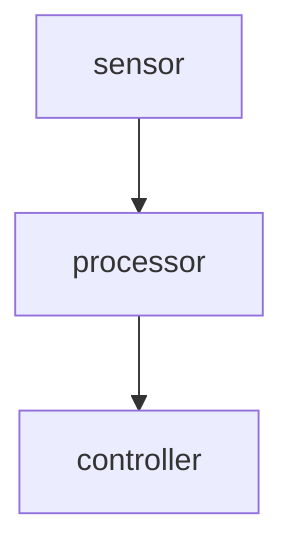

# Debugging and Observability Guide

This guide covers how to debug, record, replay, and monitor dora dataflows. It is written for new users who want to understand what went wrong in a dataflow, measure performance, or reproduce issues offline.

---

## Table of Contents

- [Prerequisites](#prerequisites)
- [Quick Debugging Checklist](#quick-debugging-checklist)
- [Record and Replay](#record-and-replay)
  - [Recording a Dataflow](#recording-a-dataflow)
  - [Recording Specific Topics](#recording-specific-topics)
  - [Proxy Recording (Remote / Diskless)](#proxy-recording-remote--diskless)
  - [Replaying a Recording](#replaying-a-recording)
  - [Replay Options](#replay-options)
  - [Selective Replay](#selective-replay)
  - [Recording File Format](#recording-file-format)
- [Node Management](#node-management)
  - [Node Info](#node-info)
  - [Node Restart](#node-restart)
  - [Node Stop](#node-stop)
- [Topic Inspection](#topic-inspection)
  - [Listing Topics](#listing-topics)
  - [Echoing Topic Data](#echoing-topic-data)
  - [Publishing Test Data](#publishing-test-data)
  - [Measuring Frequency](#measuring-frequency)
  - [Topic Metadata and Stats](#topic-metadata-and-stats)
- [Runtime Parameters](#runtime-parameters)
- [Environment Diagnosis](#environment-diagnosis)
- [Trace Inspection](#trace-inspection)
- [Resource Monitoring](#resource-monitoring)
- [Log Analysis](#log-analysis)
  - [Live Log Streaming](#live-log-streaming)
  - [Local Log Files](#local-log-files)
  - [Filtering and Searching](#filtering-and-searching)
- [Dataflow Visualization](#dataflow-visualization)
- [Monitoring Running Dataflows](#monitoring-running-dataflows)
- [End-to-End Debugging Workflows](#end-to-end-debugging-workflows)

---

## Prerequisites

Before using topic inspection commands (`topic echo`, `topic hz`, `topic info`), enable debug message publishing using either approach:

**Option 1: CLI flag (recommended)**

```bash
dora start dataflow.yml --debug
dora run dataflow.yml --debug
```

**Option 2: YAML descriptor**

```yaml
_unstable_debug:
  publish_all_messages_to_zenoh: true
```

This tells the daemon to publish all inter-node messages to Zenoh, where the coordinator can proxy them to CLI clients via WebSocket. Without this flag, topic inspection commands will return an error.

The `record`, `replay`, `logs`, `list`, `top`, `graph`, `node info/restart/stop`, `param`, and `doctor` commands do **not** require this flag. The `topic pub` command does require it.

---

## Quick Debugging Checklist

When something goes wrong, follow this sequence:

```bash
# 1. Run full environment diagnosis
dora doctor --dataflow dataflow.yml

# 2. What dataflows are active?
dora list

# 3. Inspect the problem node
dora node info -d my-dataflow problem-node

# 4. Check node resource usage
dora top

# 5. Stream logs from the problem node
dora logs my-dataflow problem-node --follow --level debug

# 6. Is the node producing output?
dora topic echo -d my-dataflow problem-node/output

# 7. Inject test data
dora topic pub -d my-dataflow problem-node/input '[1, 2, 3]'

# 8. Is it publishing at the expected rate?
dora topic hz -d my-dataflow --window 5

# 9. Check/modify runtime parameters
dora param list -d my-dataflow problem-node
dora param set -d my-dataflow problem-node debug_level 2

# 10. Restart a misbehaving node (without stopping the dataflow)
dora node restart -d my-dataflow problem-node

# 11. View coordinator traces (no external infra needed)
dora trace list
dora trace view <trace-id-prefix>

# 12. Visualize the dataflow graph
dora graph dataflow.yml --open

# 13. Record for offline analysis
dora record dataflow.yml -o debug-capture.adorec
```

---

## Record and Replay

Record captures live dataflow messages to a file. Replay substitutes source nodes with recorded data, letting you reproduce behavior without hardware.

### Recording a Dataflow

```bash
# Record all topics (default output: recording_{timestamp}.adorec)
dora record dataflow.yml

# Specify output file
dora record dataflow.yml -o my-capture.adorec
```

This injects a hidden `__dora_record__` node into the dataflow that subscribes to all node outputs and writes them to an `.adorec` file. The record node binary (`dora-record-node`) is auto-built on first use.

The recording runs until you press Ctrl-C or the dataflow stops.

### Recording Specific Topics

```bash
# Only record camera and lidar
dora record dataflow.yml --topics sensor/image,lidar/points
```

Topic names use the format `node_id/output_id`. Available topics can be discovered with `dora topic list -d <dataflow>`.

### Proxy Recording (Remote / Diskless)

When the target machine has no local disk or you want to record on your local machine:

```bash
# Start the dataflow first (detached)
dora start dataflow.yml --detach

# Record via WebSocket proxy -- data streams through coordinator to CLI
dora record dataflow.yml --proxy -o capture.adorec

# Record specific topics via proxy
dora record dataflow.yml --proxy --topics sensor/image,lidar/points
```

How proxy mode works:
1. The dataflow must already be running (`dora start --detach`)
2. The CLI connects to the coordinator via WebSocket
3. The coordinator subscribes to Zenoh on the CLI's behalf
4. Message data streams through WebSocket binary frames to the CLI
5. The CLI writes the `.adorec` file locally

This requires `publish_all_messages_to_zenoh: true` in the descriptor.

**When to use `--proxy`:**
- Embedded targets with no local disk
- Remote machines where you want the recording on your workstation
- When you only have WebSocket connectivity (no direct Zenoh access)

**When to use default mode (no `--proxy`):**
- Same machine or shared filesystem
- High-throughput scenarios (no WebSocket overhead)
- No need for `publish_all_messages_to_zenoh`

### Replaying a Recording

```bash
# Replay at original speed
dora replay recording.adorec

# Replay at 2x speed
dora replay recording.adorec --speed 2.0

# Replay as fast as possible (speed 0)
dora replay recording.adorec --speed 0
```

Replay works by:
1. Reading the `.adorec` file header to get the original dataflow descriptor
2. Identifying which nodes produced the recorded data
3. Replacing those source nodes with `dora-replay-node` instances
4. Running the modified dataflow -- downstream nodes receive replayed data identically to live data

The replay node binary (`dora-replay-node`) is auto-built on first use.

### Replay Options

| Flag | Default | Description |
|------|---------|-------------|
| `--speed <FLOAT>` | `1.0` | Playback speed multiplier. `2.0` = 2x, `0.5` = half speed, `0` = as fast as possible |
| `--loop` | off | Loop the recording continuously |
| `--replace <NODES>` | all recorded | Comma-separated list of nodes to replace |
| `--output-yaml <PATH>` | - | Write modified descriptor YAML without running |

### Selective Replay

Replace only specific source nodes while keeping others live:

```bash
# Only replace the sensor node, keep camera live
dora replay recording.adorec --replace sensor

# Replace sensor and lidar, keep everything else live
dora replay recording.adorec --replace sensor,lidar
```

This is useful when you want to debug a specific processing pipeline with known input data while keeping other parts of the system live.

### Dry Run (Output YAML)

Both record and replay support `--output-yaml` to see the modified descriptor without running:

```bash
# See what the record-injected descriptor looks like
dora record dataflow.yml --output-yaml record-modified.yml

# See what the replay-modified descriptor looks like
dora replay recording.adorec --output-yaml replay-modified.yml
```

### Recording File Format

The `.adorec` format is a simple binary file:

```
┌──────────────────────────────────┐
│ Header (bincode)                 │
│   version: u32                   │
│   start_nanos: u64               │
│   dataflow_id: Uuid              │
│   descriptor_yaml: Vec<u8>       │
├──────────────────────────────────┤
│ Entry 1 (bincode)                │
│   node_id: String                │
│   output_id: String              │
│   timestamp_offset_nanos: u64    │
│   event_bytes: Vec<u8>           │
├──────────────────────────────────┤
│ Entry 2 ...                      │
├──────────────────────────────────┤
│ ...                              │
├──────────────────────────────────┤
│ Footer (bincode)                 │
│   total_messages: u64            │
│   total_bytes: u64               │
└──────────────────────────────────┘
```

The `event_bytes` field contains the raw `Timestamped<InterDaemonEvent>` bincode payload -- the same format used on the wire between daemons. The `descriptor_yaml` in the header stores the original dataflow descriptor so replay can reconstruct the dataflow.

---

## Node Management

### Node Info

Get detailed information about a specific node including its status, inputs, outputs, metrics, and restart count:

```bash
dora node info -d my-dataflow camera

# JSON output
dora node info -d my-dataflow camera --format json
```

### Node Restart

Restart a single node without stopping the entire dataflow. Useful for recovering a misbehaving node or picking up configuration changes:

```bash
# Restart with default grace period
dora node restart -d my-dataflow camera

# Restart with custom grace period
dora node restart -d my-dataflow camera --grace 10s
```

The daemon sends a stop event, waits for the grace period, then respawns the node process.

### Node Stop

Stop a single node without stopping the entire dataflow:

```bash
dora node stop -d my-dataflow camera

# With custom grace period
dora node stop -d my-dataflow camera --grace 5s
```

---

## Topic Inspection

Topic inspection commands subscribe to live dataflow messages via the coordinator's WebSocket proxy. They require `--debug` flag or `publish_all_messages_to_zenoh: true`.

### Listing Topics

```bash
# List all topics in a running dataflow
dora topic list -d my-dataflow

# JSON output
dora topic list -d my-dataflow --format json
```

Shows each output, which node publishes it, and which nodes subscribe to it. This command reads from the descriptor and does **not** require `publish_all_messages_to_zenoh`.

### Echoing Topic Data

Stream live topic data to the terminal:

```bash
# Echo a single topic
dora topic echo -d my-dataflow camera_node/image

# Echo multiple topics
dora topic echo -d my-dataflow robot1/pose robot2/vel

# JSON output (useful for piping to jq or other tools)
dora topic echo -d my-dataflow robot1/pose --format json

# Echo all topics
dora topic echo -d my-dataflow
```

Each line shows the topic name, Arrow data content, and metadata parameters. Use `--format json` for machine-readable output:

```json
{"timestamp":1709000000000,"name":"robot1/pose","data":[1.0,2.0,3.0],"metadata":null}
```

### Measuring Frequency

Interactive TUI showing per-topic publish frequency:

```bash
# All topics with 10-second sliding window
dora topic hz -d my-dataflow --window 10

# Specific topics with 5-second window
dora topic hz -d my-dataflow robot1/pose robot2/vel --window 5
```

The TUI displays:
- Average frequency (Hz)
- Average, min, max interval
- Standard deviation
- Sparkline showing recent activity

Press `q` or Ctrl-C to exit. Requires an interactive terminal.

### Publishing Test Data

Inject data into a running dataflow for testing. Requires `publish_all_messages_to_zenoh: true`.

```bash
# Publish a single Arrow array
dora topic pub -d my-dataflow sensor/threshold '[42]'

# Publish from a JSON file
dora topic pub -d my-dataflow sensor/config --file test-config.json

# Publish multiple messages
dora topic pub -d my-dataflow sensor/trigger '[1]' --count 10
```

This is useful for:
- Testing node behavior with known input data
- Triggering specific code paths in downstream nodes
- Simulating sensor inputs without hardware

### Topic Metadata and Stats

One-shot statistics collection:

```bash
# Collect stats for 5 seconds (default)
dora topic info -d my-dataflow camera_node/image

# Collect for 10 seconds
dora topic info -d my-dataflow camera_node/image --duration 10
```

Reports:
- Arrow data type
- Publisher node
- Subscriber nodes (from descriptor)
- Message count and bandwidth
- Publishing frequency

---

## Runtime Parameters

Runtime parameters let you read and modify node configuration while a dataflow is running, without restarting. Parameters are stored in the coordinator and optionally forwarded to running nodes.

```bash
# List all parameters for a node
dora param list -d my-dataflow detector

# Get a single parameter
dora param get -d my-dataflow detector confidence

# Set a parameter (value is JSON)
dora param set -d my-dataflow detector confidence 0.8
dora param set -d my-dataflow detector config '{"nms": 0.5, "classes": ["car", "person"]}'

# Delete a parameter
dora param delete -d my-dataflow detector confidence
```

Parameters are persisted in the coordinator store (in-memory or redb). When a node is running, `param set` also forwards the new value to the node's daemon. Nodes can read parameters through the node event stream.

**Limits:** Keys max 256 bytes, values max 64KB serialized.

---

## Environment Diagnosis

`dora doctor` performs a comprehensive health check of your environment:

```bash
# Basic diagnosis
dora doctor

# Diagnosis + dataflow validation
dora doctor --dataflow dataflow.yml
```

Checks performed:
1. Coordinator reachability
2. Connected daemon status
3. Active dataflow health
4. Dataflow YAML validation (if `--dataflow` provided)

Use this as a first step when debugging any issue, or in CI to validate the environment before running tests.

---

## Trace Inspection

The coordinator captures tracing spans in-memory from `dora_coordinator` and `dora_core` crates (up to 4096 spans in a ring buffer). You can view these traces without any external tracing infrastructure (no Jaeger, Tempo, etc. required).

### Listing Traces

```bash
dora trace list
```

Shows all captured traces with their root span name, span count, start time, and total duration:

```
TRACE ID      ROOT SPAN          SPANS  STARTED              DURATION
a1b2c3d4e5f6  spawn_dataflow     12     2026-03-01 10:30:05  1.234s
f8e7d6c5b4a3  build_dataflow     5      2026-03-01 10:29:58  0.500s
```

### Viewing a Trace

```bash
# Full trace ID
dora trace view a1b2c3d4-e5f6-7890-abcd-1234567890ab

# Or use a unique prefix
dora trace view a1b2c3d4
```

Displays spans as an indented tree showing parent-child relationships, log levels, durations, and span fields:

```
spawn_dataflow [INFO 1.234s] {build_id="abc", session_id="def"}
  build_dataflow [INFO 0.500s]
    download_node [DEBUG 0.200s] {url="..."}
  start_inner [INFO 0.734s]
    spawn_node [INFO 0.100s] {node_id="camera"}
    spawn_node [INFO 0.080s] {node_id="detector"}
```

### When to Use Trace Inspection

- **Quick debugging** -- see what the coordinator did during a `start`, `stop`, or `build` without setting up Jaeger/Tempo
- **Performance analysis** -- identify slow spans in dataflow lifecycle operations
- **Deployment troubleshooting** -- understand the sequence and timing of coordinator operations

For full distributed tracing across daemons and nodes, set `DORA_OTLP_ENDPOINT` and use an OTLP-compatible backend.

---

## Resource Monitoring

`dora top` (also `dora inspect top`) provides a real-time TUI showing per-node resource usage:

```bash
# Default 2-second refresh
dora top

# Custom refresh interval
dora top --refresh-interval 5

# JSON snapshot for scripting/CI
dora top --once | jq .
```

Displays for each node:
- CPU usage (% of a single core)
- Memory (RSS)
- Node status (Running, Restarting, Degraded, Failed)
- Restart count
- Queue depth (pending messages)
- Network TX/RX (cross-daemon bytes via Zenoh)
- Disk I/O read/write

Metrics are collected by daemons and reported to the coordinator, so this works for distributed dataflows across multiple machines. Press `q` or Ctrl-C to exit.

Use `--once` to print a single JSON snapshot and exit, useful for CI pipelines and monitoring integrations.

Note: CPU percentages are per-core, so values can exceed 100% for multi-threaded nodes. Nodes on different machines may have different CPUs, so percentages are not directly comparable across machines.

---

## Log Analysis

### Live Log Streaming

```bash
# Stream logs from a specific node
dora logs my-dataflow sensor-node --follow

# Stream logs from all nodes
dora logs my-dataflow --all-nodes --follow

# Filter by log level
dora logs my-dataflow sensor-node --follow --level debug

# Stream with grep filter
dora logs my-dataflow --all-nodes --follow --grep "error"
```

Without `--follow`, reads from local log files. With `--follow`, streams live from the coordinator via WebSocket.

### Local Log Files

Logs are stored in the `out/` directory:

```
out/
  <dataflow-uuid>/
    log_<node-id>.jsonl          # current log
    log_<node-id>.1.jsonl        # rotated (previous)
    log_<node-id>.2.jsonl        # rotated (older)
```

Read directly:

```bash
# All nodes, local files
dora logs --local --all-nodes

# Specific node, last 50 lines
dora logs --local sensor-node --tail 50
```

### Filtering and Searching

| Flag | Example | Description |
|------|---------|-------------|
| `--level <LEVEL>` | `--level debug` | Minimum level: error, warn, info, debug, trace, stdout |
| `--log-filter <FILTER>` | `--log-filter "sensor=debug,processor=warn"` | Per-node level filter |
| `--grep <PATTERN>` | `--grep "timeout"` | Case-insensitive substring match |
| `--since <DURATION>` | `--since 5m` | Only logs newer than this |
| `--until <DURATION>` | `--until 1h` | Only logs older than this |
| `--tail <N>` | `--tail 100` | Show last N lines |
| `--log-format <FMT>` | `--log-format json` | Output format: pretty (default) or json |

Environment variables:
- `DORA_LOG_LEVEL` -- default log level
- `DORA_LOG_FORMAT` -- default log format
- `DORA_LOG_FILTER` -- default per-node filter

---

## Dataflow Visualization

Generate a visual graph of your dataflow:

```bash
# Generate HTML and open in browser
dora graph dataflow.yml --open

# Generate Mermaid diagram text
dora graph dataflow.yml --mermaid
```

The Mermaid output can be pasted into [mermaid.live](https://mermaid.live/) or used in GitHub markdown:

````markdown

````

The HTML mode generates a self-contained file with an interactive mermaid.js diagram.

---

## Monitoring Running Dataflows

```bash
# Full environment diagnosis
dora doctor

# List all dataflows (active and completed)
dora list

# List nodes in a specific dataflow
dora node list -d my-dataflow

# Get detailed info on a specific node
dora node info -d my-dataflow camera

# Check coordinator/daemon status
dora status

# View/modify runtime parameters
dora param list -d my-dataflow detector
dora param set -d my-dataflow detector threshold 0.5
```

`dora list` shows each dataflow's UUID, name, status, and node count. Use `-d <name>` with other commands to target a specific dataflow.

---

## End-to-End Debugging Workflows

### Workflow 1: Node Not Producing Output

```bash
# 1. Verify the node is running
dora list
dora top

# 2. Check its logs
dora logs my-dataflow problem-node --follow --level trace

# 3. Check if upstream nodes are publishing
dora topic echo -d my-dataflow upstream-node/output

# 4. Verify topic wiring
dora topic list -d my-dataflow
dora graph dataflow.yml --open
```

### Workflow 2: Unexpected Data or Wrong Values

```bash
# 1. Echo the topic to see raw data
dora topic echo -d my-dataflow node/output --format json

# 2. Record for offline analysis
dora record dataflow.yml -o debug.adorec

# 3. Replay with known input to isolate the issue
dora replay debug.adorec --replace sensor --speed 0
```

### Workflow 3: Performance Issues

```bash
# 1. Check CPU/memory per node
dora top

# 2. Measure publish frequencies
dora topic hz -d my-dataflow --window 10

# 3. Get bandwidth stats for suspected bottleneck
dora topic info -d my-dataflow heavy-node/output --duration 10

# 4. Record and replay at max speed to find throughput limits
dora record dataflow.yml -o perf.adorec
dora replay perf.adorec --speed 0
```

### Workflow 4: Reproducing a Field Issue

```bash
# On the robot / target machine:
dora start dataflow.yml --detach
dora record dataflow.yml --proxy -o field-capture.adorec

# Transfer the .adorec file to your workstation, then:
dora replay field-capture.adorec
dora replay field-capture.adorec --speed 0.5  # slow motion
dora replay field-capture.adorec --loop        # continuous replay
```

### Workflow 5: Remote Debugging (No Direct Access)

When you only have WebSocket connectivity to the coordinator:

```bash
# All these commands work over WebSocket -- no Zenoh needed
dora list
dora top
dora logs my-dataflow --all-nodes --follow
dora topic echo -d my-dataflow node/output
dora topic hz -d my-dataflow
dora record dataflow.yml --proxy -o remote-capture.adorec
```

---

## See Also

- [CLI Reference](cli.md) -- complete command reference
- [WebSocket Control Plane](websocket-control-plane.md) -- how CLI communicates with coordinator
- [WebSocket Topic Data Channel](websocket-topic-data-channel.md) -- how topic data is proxied
- [Testing Guide](testing-guide.md) -- running smoke tests
