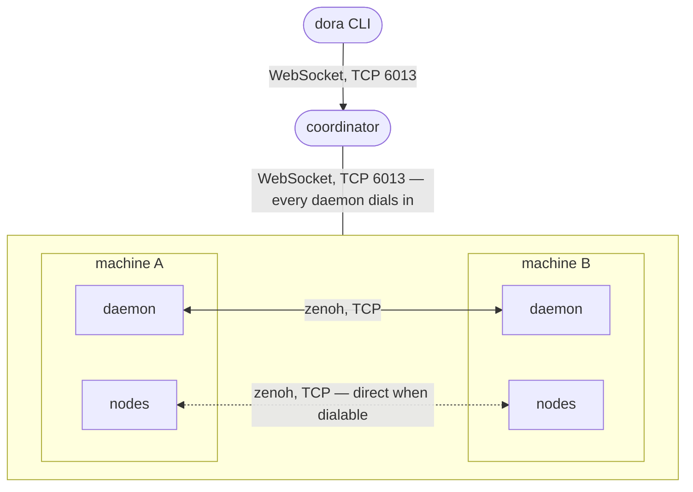
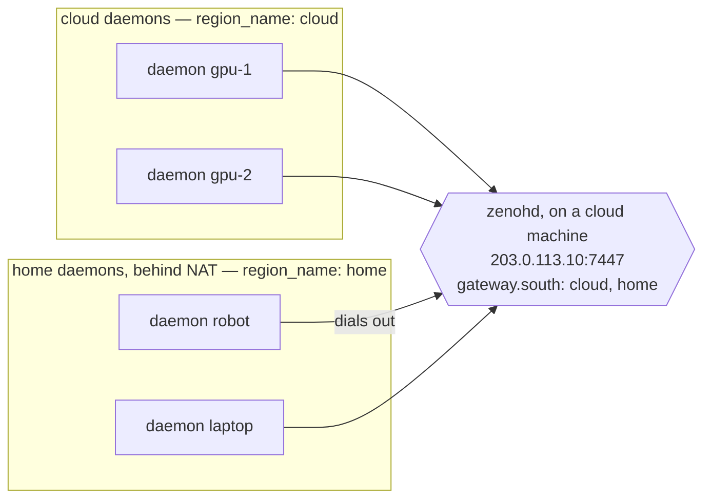
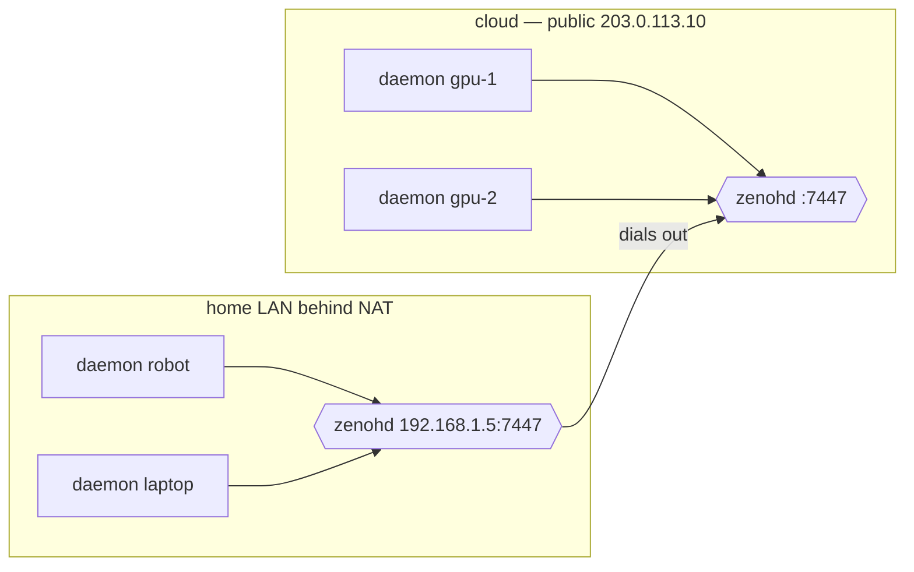

# Multi-machine Guide

A dataflow can run on several machines. Every machine runs a `dora daemon`. One machine runs the `dora coordinator`. The dataflow YAML says which node runs on which machine.

This guide explains the network between those machines: which connections are needed, and how to set them up. There are two cases:

1. [Machines that can reach each other](#1-machines-that-can-reach-each-other): one LAN or Wi-Fi network, a VPN mesh such as Tailscale or WireGuard, or a cloud VPC. Nothing needs to be configured except the addresses.
2. [Isolated subnets joined by zenoh routers](#2-isolated-subnets-joined-by-zenoh-routers): for example some machines in the cloud and some on a home Wi-Fi behind NAT, without a VPN between them.

Managing the machines themselves (a `cluster.yml` file, SSH commands, label-based scheduling, systemd services, rolling upgrades) is described in the [Distributed Deployment Guide](distributed-deployment.md).

## What talks to what



- The CLI talks to the coordinator over a WebSocket connection on TCP port 6013. `dora start`, `dora list`, `dora logs`, `dora stop` and the other commands take the address with `--coordinator-addr`, or read it from the `DORA_COORDINATOR_ADDR` environment variable.
- Every daemon opens one WebSocket connection to the coordinator, on the same port. This connection carries control messages only. Data does not go through the coordinator.
- Data between machines goes over [zenoh](https://zenoh.io/). Every daemon has a zenoh listener. Since zenoh 1.9, zenoh peers do not forward data for other peers. So two daemons that exchange data need a direct connection between them, or a path through zenoh *routers* (see setup 2). If neither exists, no data flows, and no error is reported.
- A node whose output is used on another machine also listens on the machine's network address. The consuming node connects to it directly, so the data goes from node to node in one step. If this direct connection cannot be created, the data goes through the daemons instead: node → daemon → daemon → node. This is slower, but no messages are lost. The fallback happens automatically.

### How daemons find each other

You do not have to list the daemons anywhere. Each daemon works out its own network address from the coordinator address: it takes the local address that is used to reach the coordinator. On a LAN this is the LAN address. On a VPN it is the VPN address. The daemon sends this address to the coordinator when it registers. The coordinator answers with the addresses of the daemons that registered earlier, and the new daemon connects to them. A zenoh connection carries data in both directions, so in the end every daemon is connected to every other daemon. The start order of the daemons does not matter. You can also start all daemons at the same time.

This means two things:

- **The coordinator must listen on an address that the daemons can reach.** By default it listens on loopback (`127.0.0.1`) only. A daemon that reaches its coordinator over loopback also listens on loopback only, and does not announce any address to the other daemons, because an address like `127.0.0.1` would be useless to them. Such a daemon can only be found through multicast.
- **The address a daemon announces must be reachable by the other daemons.** If it is not, for example because of a NAT, or because a machine with several network interfaces picked the wrong one, either set the address with `--zenoh-listen`, or use setup 2.

Zenoh's multicast discovery (UDP on `224.0.0.224:7446`) stays enabled by default, in addition to the coordinator mechanism. It is not needed for the setup below, but on a network that supports it, it repairs a few rare situations automatically. See [Multicast, and what to do without it](#multicast-and-what-to-do-without-it).

## 1. Machines that can reach each other

Every machine can open a TCP connection to every other machine. This is the case on one LAN or Wi-Fi network, on a VPN mesh such as Tailscale, WireGuard or Nebula, and in a cloud VPC. No zenoh configuration is needed, and it does not matter whether the network supports multicast.

Choose the machine that runs the coordinator. In this example it has the address `192.168.1.10`. On a VPN, use the VPN addresses instead, for example the `100.x.y.z` addresses of a Tailscale network. All other commands need the coordinator address, so set it once in the shell on every machine where you run commands:

```bash
export DORA_COORDINATOR_ADDR=192.168.1.10
```

On the coordinator machine, make the coordinator listen on the LAN address instead of the default loopback address. If this machine also runs nodes, start its daemon separately and give it a name. `dora up` starts a daemon without a name, and `deploy: {machine: ...}` cannot refer to a daemon without a name:

```bash
dora coordinator --interface 192.168.1.10
dora daemon --coordinator-addr 192.168.1.10 --machine-id workstation
```

If the coordinator machine does not run any nodes, `dora up --interface 192.168.1.10` starts both the coordinator and a daemon.

Use the real address of the machine here, not `0.0.0.0`. The coordinator itself can listen on `0.0.0.0`, but `dora up` also passes the address to the daemon it starts, and the daemon needs a real address to work out its own address from. With `0.0.0.0`, `dora up` connects the daemon to the coordinator over loopback instead, and the daemon then listens on loopback only. `dora coordinator --interface 0.0.0.0` is fine if you start every daemon yourself with a real `--coordinator-addr`, including the daemon on the coordinator machine.

On every other machine:

```bash
dora daemon --coordinator-addr 192.168.1.10 --machine-id robot
```

Each daemon logs the address it announces:

```
INFO dora_daemon: zenoh listener binding 192.168.1.20 (derived from coordinator address 192.168.1.10:6013); this port accepts connections from other hosts
```

On a VPN, this is the daemon's own VPN address, because the daemon reaches the coordinator through the tunnel.

The coordinator logs each registration:

```
INFO dora_coordinator: daemon robot-01a0… reports 0 running dataflow(s)
```

If a daemon reports a connection timeout instead, the coordinator listens on loopback only, or a firewall blocks the port. See [ports](#ports-and-firewalls).

Assign the nodes to machines in the dataflow, and start it from any machine:

```yaml
nodes:
  - id: camera
    deploy:
      machine: robot
    path: /opt/app/camera          # resolved on the robot
    outputs: [frames]
  - id: detector
    deploy:
      machine: workstation
    path: /opt/app/detector
    inputs:
      frames: camera/frames
```

```bash
dora build dataflow.yml     # runs each node's build on its target machine
dora start dataflow.yml --attach
```

A node without `deploy` runs on the daemon without a name, if there is one. Paths are resolved on the target machine, so use absolute paths or set `deploy.working_dir`. Dora does not copy binaries to other machines by default. See [binary distribution](distributed-deployment.md#binary-distribution) for the SCP and HTTP options.

### Machines with several network interfaces

Such a machine announces the address of the interface that is used to reach the coordinator. If the other machines cannot reach that interface, set the right address with `--zenoh-listen 100.64.0.7`. If the daemon cannot listen on the address you set, it exits with an error.

### Multicast, and what to do without it

Nothing above depends on multicast. Zenoh's multicast discovery stays enabled by default, and on a network that supports it, it repairs three rare situations that the coordinator mechanism does not:

- A daemon that registers while the coordinator is down or restarting gets the list that the coordinator has at that moment, which may be empty. Daemons that are already running are not affected, because their connections do not go through the coordinator.
- A daemon gets the addresses of its peers only once, when it registers. If one of these addresses is no longer valid, that daemon keeps the invalid address. A daemon whose listener could not be created withdraws its address, so this only affects daemons that already received it.
- A dynamic node that you start by hand finds the daemon's zenoh session through multicast, unless `DORA_ZENOH_CONNECT` is set in its environment.

These networks usually do not support multicast: guest or company Wi-Fi with client isolation, Docker's default bridge network, dev containers, cloud VPCs, and all VPN or mesh tunnels. On such a network, the first two situations are not repaired automatically. Restart the affected daemon in both cases. There is also a third situation that only the explicit configuration below can handle: only the new daemon opens connections, so on a network that allows connections in one direction only, the connection only works if the daemon that can connect registers second.

If your deployment must handle these cases without a restart, or must be connected before the coordinator is reachable, configure the connections explicitly. Every daemon then listens on a fixed port and connects to every other daemon. Because both sides connect, a connection is created as soon as one side can reach the other. For example, on a Tailscale network:

```bash
dora daemon --coordinator-addr 100.64.0.1 --machine-id robot \
  --zenoh-listen 100.64.0.7:5456 \
  --zenoh-connect tcp/100.64.0.1:5456,tcp/100.64.0.9:5456
```

`dora cluster up` creates this configuration from a `cluster.yml` file whose `host:` fields are the tunnel addresses. It also provides SSH-based management, systemd installation and rolling upgrades. See the [cluster configuration reference](distributed-deployment.md#cluster-configuration-reference).

Setting connect endpoints turns multicast discovery off for that daemon and its nodes, because they no longer need it. You can also turn it off with `--zenoh-no-multicast`. This is optional: on a network without multicast, discovery finds nothing and only uses a socket. But in some environments zenoh cannot even open its multicast socket (usually because of a busy DDS/ROS 2 setup on the same machine), and then the zenoh session fails to start; the flag avoids that. Dynamic nodes that you start by hand then need `DORA_ZENOH_CONNECT=<the daemon's listen endpoint>` in their environment.

## 2. Isolated subnets joined by zenoh routers

Some machines cannot open a connection to some other machines in either direction, and a VPN is not an option. A typical example: a robot on a home Wi-Fi behind NAT, and GPU machines in the cloud. With two robots at two different sites, neither robot can connect to the other.

Zenoh routers solve this. A router forwards data between the *regions* connected to it, and to other routers. Every daemon connects to a router it can reach. Data between networks then goes from daemon to router to daemon.



Arrows show which side opens the connection. The router is not part of either region. It sits above both regions, and it puts each daemon that connects into a subregion, based on the `region_name` that the daemon declares. The diagram does not show the direct connections between the daemons of one site, and it does not show the WebSocket connection from each daemon to the coordinator. The home daemons reach the coordinator at its public address.

**Every network must be its own zenoh region.** Zenoh expects the peers of one region to connect to each other directly. Since zenoh 1.9, a router does not forward data between two peers of the same region that cannot connect to each other. If you point all daemons to one router without further configuration, they all end up in one region. We tested this with dora 1.0 (zenoh 1.9.0) behind an emulated NAT: the two daemons discovered each other through the router, but 0 of 100 messages arrived, in both directions. The consumer node finished without receiving any value. You can recognize this misconfiguration by the zenoh warning `Unable to connect to any locator of scouted peer ...` with addresses from the other network. It means that the router gives the daemons each other's addresses, but the daemons cannot reach them.

There are two ways to give each network its own region. Both delivered 100 of 100 messages in both directions in the same test:

- **One router, one subregion per network.** The router's `gateway.south` configuration lists the networks. The daemons of each network declare a `region_name`. This needs only one `zenohd` in the cloud. To add a network, you add a line to the router config and restart the router. This setup is described next.
- **One router per network.** Each network runs its own `zenohd`. The routers behind NAT connect to the public router. Each daemon connects to the router of its own network. This needs no router configuration and no region names, but it needs a machine that is always on at every site. See [One router per network instead](#one-router-per-network-instead).

### Setting it up

Install [`zenohd`](https://zenoh.io/docs/getting-started/installation/) on a cloud machine, for example on the coordinator machine. Use a 1.9 release, because dora is built with zenoh 1.9. If there is no package for your platform, `cargo install zenohd --version "~1.9"` builds it from source.

**Router.** Create a config file with one subregion per network. Each subregion matches a region name:

```json5
// router.json5
{
  gateway: {
    south: [
      { filters: [{ region_names: ["cloud"] }] },
      { filters: [{ region_names: ["home"] }] },
    ],
  },
}
```

```bash
zenohd -c router.json5 -l tcp/0.0.0.0:7447
dora coordinator --interface 0.0.0.0
```

Both ports (7447 and 6013) must accept incoming TCP connections from the home networks.

**Cloud daemons.** Each cloud daemon uses an overlay file with the router address and the region name. It connects to the coordinator at its VPC address. This is also the address that the daemon announces to the other cloud daemons:

```json5
// cloud.json5
{ connect: { endpoints: ["tcp/10.0.0.10:7447"] }, region_name: "cloud" }
```

```bash
dora daemon --coordinator-addr 10.0.0.10 --machine-id gpu-1 --zenoh-config-overlay cloud.json5
```

**Home daemons.** The home daemons use an overlay file with the router's public address and their own region name. They connect to the coordinator at its public address:

```json5
// home.json5
{ connect: { endpoints: ["tcp/203.0.113.10:7447"] }, region_name: "home" }
```

```bash
dora daemon --coordinator-addr 203.0.113.10 --machine-id robot --zenoh-config-overlay home.json5
```

The overlay file is JSON5, the format of zenoh's own configuration. The `connect.endpoints` and `listen.endpoints` lists in the overlay are *added* to the endpoints that dora computes. Every other key, such as `region_name`, replaces dora's value. The overlay applies to the daemon and to all nodes that the daemon starts. (Setting `DORA_ZENOH_CONFIG_OVERLAY` in the daemon's environment has the same effect.) This is what puts the nodes of a network into the same region as their daemon. All daemons of one network use the same overlay file, and every region name used in an overlay must be listed in the router config. Do not use `ZENOH_CONFIG` for this. It replaces dora's whole configuration, including the direct connections between nodes on the same machine, so even local data would go through the router. Setting both is an error.

Dataflows are started as usual, from any machine that can reach the coordinator:

```bash
dora start dataflow.yml --coordinator-addr 203.0.113.10 --attach
```

### One router per network instead

In this variant, the router config and the `region_name` keys are not needed. Run a `zenohd` on each network. The routers behind NAT connect to the public router. Each daemon's overlay points to the router of its own network. The peers connected to one router form a region of their own, so no region names are needed.



```bash
# cloud
zenohd -l tcp/0.0.0.0:7447

# home, on the machine 192.168.1.5
zenohd -l tcp/192.168.1.5:7447 -e tcp/203.0.113.10:7447
```

```json5
// cloud.json5
{ connect: { endpoints: ["tcp/10.0.0.10:7447"] } }
// home.json5
{ connect: { endpoints: ["tcp/192.168.1.5:7447"] } }
```

### What to expect

- Daemons on the same network still connect directly and run at full speed. The coordinator mechanism works as in setup 1.
- The coordinator also gives each daemon the addresses of the daemons on the *other* network. The daemon cannot reach these addresses. The connection attempts fail and are retried in the background. Zenoh logs one `Scouting delay elapsed before start conditions are met` warning at startup. This is harmless.
- Setting a router in the overlay turns multicast discovery off for that daemon and its nodes.
- Node outputs that cross networks cannot use a direct node-to-node connection. They go through the daemons and the router instead. When such a dataflow starts, the daemons wait up to 1.5 seconds for the node addresses of the other network, and then log `WARN dora_daemon::spawn::endpoint_exchange: no zenoh endpoint for remote node(s) [...] after 1.5s; their outputs will reach this daemon's nodes over the daemon path instead of directly`. This warning is expected in this setup. Setting `DORA_ZENOH_ENDPOINT_EXCHANGE_TIMEOUT_MS=0` in the daemon's environment skips the wait, but it also disables direct node-to-node connections *within* a network.
- Data between networks takes two extra hops and crosses the internet. With large messages at high rates, this is noticeable. Keep such connections inside one network where possible.

Both layouts were verified in the test described above: two networks, no daemon able to reach any daemon on the other side, and data flowing in both directions.

### When you do not need a router

If one side has public machines and you can open the daemon port on them, the daemons behind NAT can connect to these machines directly. A zenoh connection carries data in both directions once it exists. Give the public daemons a fixed port, and configure the daemons behind NAT to connect to it explicitly. An explicit connection does not depend on the registration order:

```bash
# cloud: a fixed port, opened in the firewall for the home network
dora daemon --coordinator-addr 10.0.0.10 --machine-id gpu-1 --zenoh-listen 10.0.0.10:5456

# home
dora daemon --coordinator-addr 203.0.113.10 --machine-id robot --zenoh-connect tcp/203.0.113.10:5456
```

This is the explicit configuration from setup 1, used from one side only. It does not work when two networks behind NAT need to talk to each other. Use routers in that case.

## Ports and firewalls

| Connection | Port | Where to allow it | Setup |
|---|---|---|---|
| CLI → coordinator | TCP 6013 | on the coordinator machine, from every machine where you run `dora` | both |
| daemon → coordinator | TCP 6013 | on the coordinator machine, from every daemon | both |
| daemon ↔ daemon | TCP; the port is chosen by the OS unless set with `--zenoh-listen <IP>:<PORT>` (usually 5456) | on every daemon machine, from every other daemon | 1; in 2 only inside one network |
| node → node across machines | TCP; the port is chosen by the OS | on the producer's machine, from the consumer's machine | optional; without it, the data goes through the daemons after 1.5 s |
| multicast discovery | UDP 224.0.0.224:7446 | on the LAN | 1, optional |
| daemon → router, router ↔ router | TCP 7447 | on the router machine, from every network. With one router per network: on each router from its own network, and on the public router from the other routers | 2 |

The daemon's `--local-listen-port` (53291) listens on loopback only. It is used by dynamic nodes on the same machine and never needs to be opened.

On a LAN or VPN, the simplest rule is to allow all TCP connections between the machines of the deployment, because the ports of daemons and nodes are chosen by the operating system and cannot be predicted. If you need a fixed list of ports, set the daemon ports with `--zenoh-listen <IP>:<PORT>`. Node outputs that cross machines then go through the daemons.

## Checking that it works

- `dora status --coordinator-addr <IP>` shows whether the coordinator and the daemon are reachable, and the number of active dataflows.
- The coordinator log has one line `daemon <id> reports N running dataflow(s)` for each registered daemon.
- The daemon log has a line `zenoh listener binding <address> ...; this port accepts connections from other hosts` at startup. It shows the announced address. If the address is `127.0.0.1`, the coordinator address that the daemon was given is loopback, or there is no route to it.
- With `RUST_LOG=dora_daemon=debug`, the daemons log how each cross-machine connection was set up when a dataflow starts. `resolved 1/1 remote node zenoh endpoints` means that the direct node-to-node connection was created. The warning `no zenoh endpoint for remote node(s) ... daemon path` means that the data goes through the daemons.
- `dora logs <dataflow> --node <id>` shows the output of a node on another machine, in the same way as for a local node.

Common mistakes:

- The coordinator listens on loopback only: the daemons report a connection timeout.
- `dora up --interface 0.0.0.0` on a machine that also runs nodes: the daemon started by `dora up` listens on loopback only. Use the real address of the machine, or start that daemon separately.
- Two daemons on one machine: the second one needs `--local-listen-port`.
- `deploy.machine` names a machine id that no daemon registered with: `dora start` fails with `no matching daemon for machine id ...`. Check the `--machine-id` of each daemon.
- The node `path` exists on the machine where you ran the command, but not on the target machine.

## Reference

| Flag / variable | Meaning |
|---|---|
| `--coordinator-addr <IP>` / `DORA_COORDINATOR_ADDR` | The address that the daemon and the CLI connect to. The daemon also uses it to work out its own zenoh address. |
| `--coordinator-port <PORT>` / `DORA_COORDINATOR_PORT` | The coordinator's WebSocket port (default 6013). |
| `dora coordinator --interface <IP>`, `dora up --interface <IP>` / `DORA_COORDINATOR_INTERFACE` | The address the coordinator listens on. Default: loopback. |
| `--machine-id <ID>` | The name used in `deploy.machine`. One daemon can stay without a name; it then runs the nodes that have no `deploy` section. |
| `--local-listen-port <PORT>` | Loopback port for dynamic nodes (default 53291). Only matters when several daemons run on one machine. |
| `--zenoh-listen <IP>[:<PORT>]` | Sets the daemon's zenoh listen address instead of the derived one. With a port, other daemons can connect before the daemon has announced its address. |
| `--zenoh-connect <endpoint>,...` | Daemons to connect to explicitly. This turns multicast discovery off. |
| `--zenoh-peer <endpoint>` | Older alternative: one shared meeting point that every daemon listens on and connects to. The connections between daemons are then left to zenoh's gossip discovery. |
| `--zenoh-no-multicast` / `DORA_ZENOH_MULTICAST=off` | Start zenoh sessions without multicast discovery, for the daemon and its nodes. |
| `--zenoh-config-overlay <PATH>` / `DORA_ZENOH_CONFIG_OVERLAY` | A JSON5 file that is added on top of dora's zenoh configuration, for the daemon and its nodes. Endpoint lists are added; other keys replace dora's values. |
| `ZENOH_CONFIG` | Replaces dora's whole zenoh configuration. This also removes the planned connections between nodes. Prefer the overlay. |
| `DORA_ZENOH_ENDPOINT_EXCHANGE_TIMEOUT_MS` | How long the daemons wait for the node addresses of other machines, for direct node-to-node connections (default 1500 ms). `0` makes all cross-machine data go through the daemons. |

Related: [Distributed Deployment Guide](distributed-deployment.md) (`cluster.yml`, cross-machine node communication, custom zenoh configuration), [CLI reference](cli.md#distributed-deployments), [`examples/multiple-daemons`](../examples/multiple-daemons/README.md).
