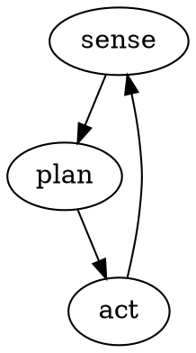

# Octos + Dora Integration Report

**Date**: 2026-03-30
**Author**: Research by Claude Code
**Purpose**: Evaluate Octos as Dora's agentic brain/orchestration layer

---

## Executive Summary

[Octos](https://github.com/octos-org/octos) (Open Cognitive Tasks Orchestration System) is a Rust-native agentic OS that can serve as Dora's "brain" — handling thinking, planning, and orchestration while Dora handles real-time execution. Both projects share the same Rust toolchain (edition 2024, MSRV 1.85.0) and Apache-2.0 license, making them a natural pairing.

**Key finding**: The integration is viable today via Octos's `ShellTool` + Dora's JSON CLI output. A dedicated Octos skill or MCP server would make it production-grade.

---

## What is Octos?

Octos is a **Rust-native, API-first platform for running AI agents**. The octopus metaphor is literal: "9 brains (1 central + 8 in each arm), every arm thinks independently, but they share one brain."

| Attribute | Detail |
|-----------|--------|
| Language | 100% Rust (`deny(unsafe_code)` workspace-wide) |
| Binary | Single 31MB static binary, zero runtime dependencies |
| License | Apache-2.0 |
| Created | March 15, 2026 (~2 weeks old) |
| Stars | 9 (very early stage) |
| Releases | v0.1.0, v0.1.1, v0.1.2-rc2 |
| LLM Providers | 15 native (Anthropic, OpenAI, Google, DeepSeek, Groq, Ollama, vLLM, etc.) |
| MCP Support | Full (stdio + HTTP transports) |

### Workspace Crates

| Crate | Role |
|-------|------|
| `octos-cli` | CLI binary (`octos` command) |
| `octos-agent` | Agent loop, tool execution, plugins, MCP, hooks, session management |
| `octos-llm` | LLM provider abstraction, registry, routing, retry, streaming |
| `octos-core` | Core types (Message, Task, TokenUsage, AgentId) |
| `octos-memory` | Episodic memory (redb), HNSW vector search |
| `octos-pipeline` | DOT graph-based multi-step pipeline orchestration |
| `octos-plugin` | Plugin manifest parsing, discovery, gating |
| `octos-bus` | Internal event bus |

---

## How Octos Works

### Agent Loop (ReAct-style)

1. Build messages: system prompt + history + user message
2. Call LLM with tool specs
3. If LLM returns tool calls -> execute all tools **in parallel** (tokio::spawn per tool)
4. Append tool results to conversation
5. Loop back to step 2
6. Stop on: text-only response, budget exhaustion, or loop detection

### Key Capabilities

- **Budget controls**: max iterations (default 50), max tokens, wall-clock timeout (default 10min), per-tool timeout
- **Loop detection**: 12-step window detects stuck agents
- **Message repair**: 6 repair passes before each LLM call to handle provider quirks
- **LRU tool deferral**: Only 15 tools active at a time for fast LLM reasoning; idle tools auto-evict with `activate_tools` meta-tool to bring them back
- **Sub-agents**: `SpawnTool` spawns child agents with different models
- **5 queue modes**: Followup, Collect, Steer, Interrupt, Speculative — control concurrent message handling

### 30+ Built-in Tools

| Tool | Type |
|------|------|
| `ShellTool` | Shell out to system commands |
| `ReadFileTool`, `WriteFileTool`, `EditFileTool` | File I/O |
| `GlobTool`, `GrepTool`, `ListDirTool` | File search |
| `WebFetchTool`, `WebSearchTool`, `DeepSearchTool` | Web access |
| `BrowserTool` | Headless Chrome |
| `SpawnTool` | Spawn sub-agents with different models |
| `SaveMemoryTool`, `RecallMemoryTool` | Long-term memory |
| `GitTool` | Git operations |
| `ManageSkillsTool` | Install/remove skills at runtime |

### LLM Provider Resilience

3-layer failover:
1. **RetryProvider** — per-provider retries with backoff
2. **ProviderChain** — fallback chain across providers
3. **AdaptiveRouter** — hedge racing, lane scoring, circuit breakers, QoS scores

### Skills (Plugin System)

Extensions are called **Skills** = standalone executable + manifest.json + SKILL.md

- Communication: stdin/stdout JSON (any language)
- Distribution: [octos-hub](https://github.com/octos-org/octos-hub) registry
- Can bundle MCP servers, lifecycle hooks, system prompt fragments
- Install: `octos skills install user/repo`

### Multi-Channel Support

14 channels: Telegram, Discord, Slack, WhatsApp, WeChat, Feishu, QQ, Email, Matrix, and more. Enables human-in-the-loop robot control from any messaging platform.

---

## Dora CLI as Octos's Execution Interface

Dora's CLI is well-suited for AI agent control:

### Available Commands (~30)

**Lifecycle**: `run`, `up`, `down`, `start`, `stop`, `restart`, `build`
**Monitoring**: `list`/`ps`, `logs`, `inspect top`, `topic echo/hz/info`, `node list/info`
**Parameters**: `param list/get/set/delete`
**Topics**: `topic pub/echo/hz`
**System**: `status`, `check`, `doctor`, `validate`, `graph`
**Cluster**: `cluster up/status/down/install/uninstall`

### Machine-Readable Output

```bash
dora list -f json          # JSON dataflow list
dora status --format json  # JSON system status
dora inspect top --once    # Single JSON metrics snapshot
dora list --quiet          # UUIDs only, one per line
```

### Composability

```bash
UUID=$(dora list -q | head -1)
dora logs $UUID
dora stop $UUID --grace 10s
dora param set $UUID node_name param_key value
```

---

## Architecture: Octos + Dora

```
                    ┌─────────────────────────────┐
                    │         OCTOS (Brain)        │
                    │  Agent Loop (ReAct)          │
                    │  Planning (DOT pipelines)    │
                    │  Memory (episodic + vector)  │
                    │  15 LLM backends             │
                    │  MCP + Skills ecosystem      │
                    └──────────┬──────────────────┘
                               │ ShellTool / Dora skill
                               ▼
                    ┌─────────────────────────────┐
                    │      ADORA CLI (Executor)    │
                    │  dora run/start/stop        │
                    │  dora node add/remove       │
                    │  dora param set/get         │
                    │  dora topic pub/echo        │
                    │  dora inspect top --once    │
                    │  JSON output mode (-f json)  │
                    └──────────┬──────────────────┘
                               │ WebSocket
                               ▼
                    ┌─────────────────────────────┐
                    │  Coordinator → Daemon(s)     │
                    │  → Nodes / Operators         │
                    │  (real-time robotics)        │
                    └─────────────────────────────┘
```

### Why This Pairing Works

| Dimension | Compatibility |
|-----------|--------------|
| Language | Both 100% Rust, same edition/MSRV |
| License | Both Apache-2.0 |
| CLI interface | Dora has JSON output (`-f json`), composable commands |
| Tool execution | Octos's `ShellTool` shells out to CLIs |
| Plugin model | Octos skills are stdin/stdout JSON — easy to write an Dora skill |
| Sandbox | Octos sandboxes tool execution (bwrap/sandbox-exec) |
| MCP | Octos has full MCP support — Dora could expose an MCP server |

### Separation of Concerns

```
Octos (deliberative layer, 100ms-5s cycle)
  ├── Task planning and decomposition
  ├── High-level decision making
  ├── Error recovery and replanning
  ├── Human-in-the-loop approvals (via Telegram/Discord/Slack)
  └── Memory and learning

Dora (reactive layer, microsecond cycle)
  ├── Sensor data processing
  ├── Real-time control loops
  ├── Zero-copy message passing
  └── Node lifecycle management
```

**Important**: Octos should NOT be in the hot path. It sets up dataflows, monitors them, adjusts parameters, and intervenes when things go wrong — it does not process every sensor reading.

---

## Integration Approaches

### Approach 1: Direct ShellTool (Start Here)

The agent's system prompt instructs it to use Dora CLI directly:

```
You are a robotics controller. You manage Dora dataflows using the dora CLI.
Always use -f json for machine-readable output.
Never start dangerous operations without confirmation.
```

| | |
|---|---|
| **Effort** | Zero development |
| **Pros** | Works today, all features available |
| **Cons** | No type safety, agent might hallucinate invalid commands |

### Approach 2: Dedicated Octos Skill (Recommended)

Write an `octos-dora` skill with typed tool definitions:

```json
{
  "name": "dora",
  "tools": [
    {"name": "dora_run", "description": "Run a dataflow", "input": {"dataflow": "string"}},
    {"name": "dora_list", "description": "List running dataflows"},
    {"name": "dora_stop", "description": "Stop a dataflow", "input": {"uuid": "string"}},
    {"name": "dora_node_info", "description": "Get node status"},
    {"name": "dora_param_set", "description": "Set runtime parameter"},
    {"name": "dora_topic_pub", "description": "Publish to a topic"}
  ]
}
```

| | |
|---|---|
| **Effort** | Low-medium (skill is a thin CLI wrapper) |
| **Pros** | Clean abstraction, typed interface, installable via `octos skills install`, benefits from tool policy/approval |
| **Cons** | Extra layer to maintain |

### Approach 3: Dora MCP Server (Medium-term)

Expose Dora's coordinator API as an MCP server. Octos connects natively.

| | |
|---|---|
| **Effort** | Medium-high (new MCP server for Dora) |
| **Pros** | Tightest integration, real-time streaming, no CLI overhead, framework-agnostic |
| **Cons** | New development required |

### Approach 4: Octos Pipeline for Complex Workflows

Use DOT-graph pipelines for multi-step robotics workflows:



| | |
|---|---|
| **Effort** | Low (pipeline definition only) |
| **Pros** | Sense-plan-act loop, different models per stage, checkpointing |
| **Cons** | DOT format is unusual, pipeline engine is new/unproven |

### Recommended Path

**Phase 1**: Start with Approach 1 (Direct ShellTool) — validate the concept
**Phase 2**: Graduate to Approach 2 (Octos Skill) — formalize the interface
**Phase 3**: Build Approach 3 (MCP Server) — production-grade integration

---

## Pros and Cons

### Advantages of Octos as Dora's Brain

1. **Rust-Rust stack** — same toolchain, no Python runtime, single deployment
2. **Sophisticated agent loop** — budget controls, loop detection, message repair, LRU tool deferral
3. **Multi-model routing** — cheap models for monitoring, expensive for planning, reasoning for hard decisions
4. **3-layer provider failover** — retry, chain, adaptive routing with circuit breakers
5. **Memory system** — episodic + HNSW vector search for long-running tasks
6. **Multi-channel** — human-in-the-loop from Telegram/Discord/Slack
7. **Sandbox execution** — safe tool execution (critical for robotics)
8. **Sub-agent spawning** — specialist agents for different robot subsystems
9. **Lifecycle hooks** — before/after tool execution for safety checks
10. **Pipeline engine** — multi-step workflows with checkpointing

### Risks and Concerns

1. **Extremely early** — 2 weeks old, 9 stars, API will break
2. **Unproven at scale** — no known production deployments
3. **China-centric provider focus** — DashScope, MiniMax, ZhiPu, Moonshot (niche providers)
4. **No robotics-specific features** — no safety interlocks, no real-time guarantees
5. **LLM latency in control loop** — 100ms-5s per decision vs Dora's microsecond messaging
6. **Single maintainer risk** — appears to be primarily one team's project
7. **No formal safety model** — robotics needs hard safety guarantees beyond sandbox

---

## Alternatives Comparison

| | Octos | Open Interpreter | LangGraph | CrewAI | Custom (Rust) |
|---|---|---|---|---|---|
| **Rust-native** | Yes | No (Python) | No (Python) | No (Python) | Yes |
| **CLI tool use** | Built-in ShellTool | Core feature | Via tools | Via tools | You build it |
| **Multi-model** | 15 providers | Several | Via LangChain | Several | You build it |
| **Safety/sandbox** | Yes (bwrap/codex) | Minimal | None | None | You build it |
| **Memory** | Episodic + vector | Conversation | Checkpoints | Short-term | You build it |
| **Maturity** | 2 weeks | 2 years | 1 year | 1 year | N/A |
| **Community** | 9 stars | 55k stars | 10k stars | 25k stars | N/A |
| **Deployment** | Single binary | pip install | pip install | pip install | Your binary |
| **Sub-agents** | SpawnTool | No | Subgraph | Crew members | You build it |
| **Multi-channel** | 14 built-in | No | No | No | You build it |
| **Pipeline/workflow** | DOT graph engine | No | Graph-based | Task-based | You build it |
| **MCP support** | Full | No | Partial | No | You build it |

### When to Choose Each

- **Octos**: You want all-Rust, multi-channel, multi-model, and are OK with early-stage risk
- **Open Interpreter**: You want battle-tested CLI control and don't mind Python
- **LangGraph**: You need complex stateful agent graphs and have a Python stack
- **CrewAI**: You want multi-agent collaboration with minimal setup
- **Custom Rust**: You need maximum control, minimal dependencies, and have bandwidth to build

---

## Safety Considerations for Robotics

Neither Octos nor Dora alone provides robotics-grade safety. You need additional layers:

1. **Hardware E-stop** — bypasses all software, kills actuators immediately
2. **Watchdog timer** — kills actuators if Octos stops responding within N ms
3. **Parameter bounds checking** — validate motor/actuator values before Octos can set them
4. **Human approval gates** — Octos has `GateHandler` in pipelines for this
5. **Action classification** — categorize commands as safe/dangerous, require confirmation for dangerous ones
6. **Audit logging** — record every command Octos sends to Dora with timestamps

---

## Quick Start

```bash
# 1. Install Octos
cargo install octos-cli

# 2. Configure with Claude
octos config set default_provider anthropic
octos config set anthropic_api_key $ANTHROPIC_API_KEY

# 3. Create an Dora controller profile
octos profile create dora-controller \
  --system-prompt "You are a robotics controller. You manage Dora dataflows \
using the dora CLI. Always use -f json for machine-readable output. \
Never start dangerous operations without confirmation."

# 4. Test the integration
octos chat dora-controller "List all running dataflows and their health status"
# Agent will call: dora list -f json && dora inspect top --once

# 5. Run a dataflow
octos chat dora-controller "Start the sensor fusion dataflow and monitor it"
# Agent will call: dora run examples/sensor-fusion/dataflow.yml --detach
# Then: dora inspect top --once (periodically)
```

---

## Open Questions

1. **Latency budget**: What's the acceptable decision latency for your use case? If sub-100ms, Octos may need to pre-compute decisions rather than query LLMs in real-time.
2. **Failure mode**: When Octos's LLM call fails or times out, what should Dora do? Continue last command? Safe stop? This needs explicit design.
3. **State sync**: How does Octos know the current state of the robot? Polling (`dora inspect`) vs push (topic subscription)?
4. **Multi-robot**: If controlling multiple Dora instances, does Octos run one agent per robot or one agent for the fleet?
5. **Cost**: LLM inference costs for continuous robot monitoring could be significant. What's the acceptable $/hour?

---

## Conclusion

Octos is a technically impressive match for Dora — same language, same toolchain, complementary architectures. The deliberative/reactive split (Octos thinks, Dora executes) is a well-established pattern in robotics (cf. subsumption architecture, 3T architecture).

**The main risk is maturity.** Octos is 2 weeks old. Mitigate by: pinning to a specific release, keeping the integration layer thin (CLI-based), and having a fallback plan (direct Anthropic API + custom agent loop).

**Recommended next step**: Try Approach 1 (Direct ShellTool) this week. If it works for your use case, invest in Approach 2 (dedicated skill) and propose an upstream MCP server for Dora.
