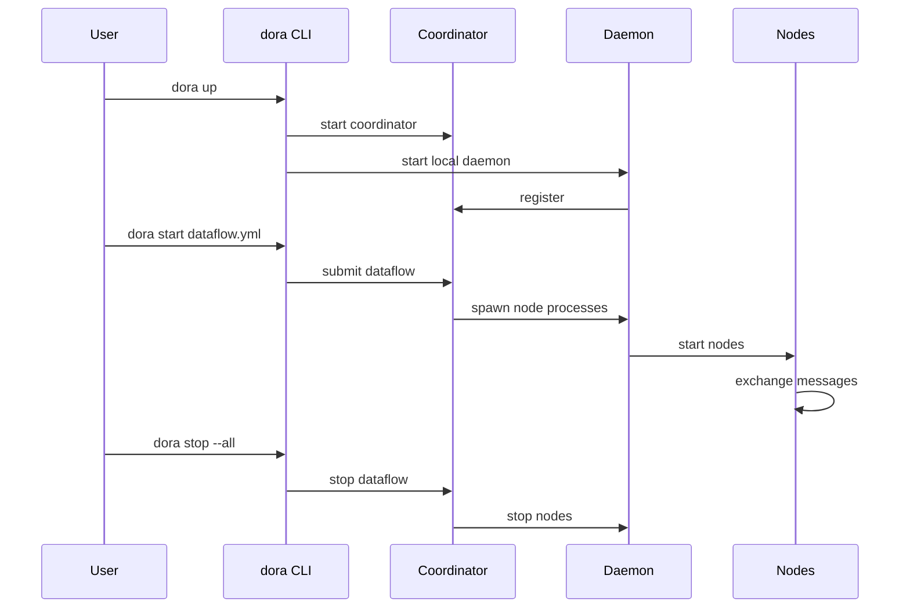

# Quickstart Guide

Get a dataflow running in 5 minutes.

## Install

**CLI** (Rust):
```bash
cargo install dora-cli --locked
```

Or download a prebuilt binary from [GitHub Releases](https://github.com/dora-rs/dora/releases).

**Python node API** (optional):
```bash
pip install dora-rs
```

## Create a Project

```bash
# Rust project
dora new my-project --lang rust

# Python project
dora new my-project --lang python
```

This scaffolds a complete dataflow with a talker/listener pair, `Cargo.toml` or `pyproject.toml`, and a `dataflow.yml`.

## Build and Run

```bash
cd my-project

# Build all nodes
dora build dataflow.yml

# Run the dataflow in isolation
dora run dataflow.yml
```

Press `Ctrl+C` to stop.

`dora run` is an isolated single-shot mode: it spawns nodes in-process
without a coordinator, so CLI monitoring commands (`dora list`, `dora
stop`, `dora logs`, `dora top`, ...) do **not** attach to it. Use `dora
up` + `dora start` (see [Networked Mode](#networked-mode) below) when
you want to attach those tools or run more than one dataflow at a time.

## What Just Happened?

`dora run` builds your nodes and runs the dataflow defined in `dataflow.yml`:

```
Timer (1Hz) --> Talker --> Listener
```

- **Timer**: built-in node that ticks at a configured rate
- **Talker**: your node that receives ticks and sends output
- **Listener**: your node that receives the talker's output

## Networked Mode

For production or multi-machine deployments, use the coordinator/daemon architecture:

```bash
# Terminal 1: start coordinator + daemon
dora up

# Terminal 2: build and run
dora build dataflow.yml
dora start dataflow.yml

# Monitor
dora list          # show running dataflows
dora logs --node my-node  # stream node logs
dora top           # resource usage
dora clean         # drop finished/failed entries from the list (keeps coordinator running)

# Stop
dora stop --all
dora down
```



## Next Steps

- **Examples**: Browse `examples/` for service, action, streaming, and Python patterns
- **Python guide**: `docs/python-guide.md`
- **Dataflow YAML**: `docs/yaml-spec.md`
- **Communication patterns**: `docs/patterns.md` (topic, service, action, streaming)
- **Architecture**: `docs/architecture.md`
- **CLI reference**: `docs/cli.md`

## Troubleshooting

```bash
# Check system health
dora doctor

# Validate a dataflow without running it
dora validate dataflow.yml

# Check type compatibility
dora validate --strict-types dataflow.yml
```
