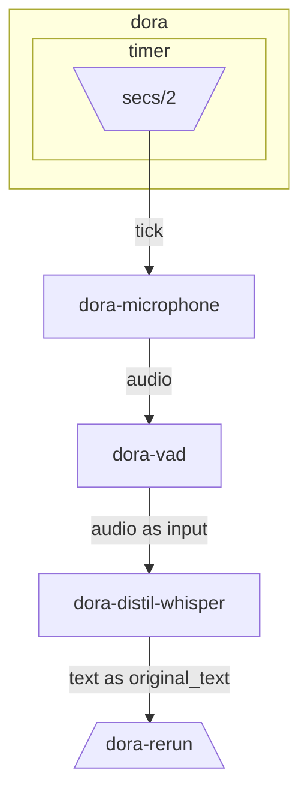

# Dora Speech to Text example

Make sure to have, dora, pip and cargo installed.

```bash
uv venv --seed -p 3.11
uv pip install -e ../../apis/python/node --reinstall
dora build whisper.yml --uv
dora run whisper.yml --uv

# Wait for the whisper model to download which can takes a bit of time.
```

## Graph Visualization


