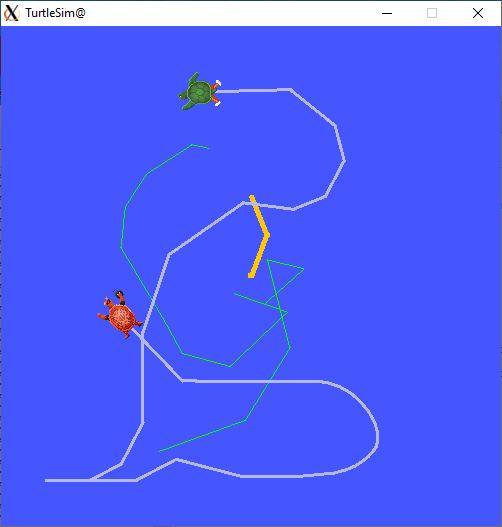

# ROS2 Client

This is a Rust native client library for [ROS2](https://docs.ros.org/en/galactic/index.html). 
It does not link to [rcl](https://github.com/ros2/rcl), 
[rclcpp](https://docs.ros2.org/galactic/api/rclcpp/index.html), or any non-Rust DDS library. 
[RustDDS](https://github.com/jhelovuo/RustDDS) is used for communication.

## Architecture Ideas

The intetion is that this is a medium-level library between lower-level DDS and a higher-level library.
The (yet-to-be-written) higher-level library should provide an event loop, Actions, and possibly an async API. These are to be implemented as a separate crate on top of this one.

## New in version 0.5:

* Actions are supported
* async programming interface. This may make a built-in event loop redundant, as Rust async executors sort of do that already.

## Example: turtle_teleop

The included example program should be able to communicate with out-of-the-box ROS2 turtlesim example.

Install ROS2 and start the simulator by ` ros2 run turtlesim turtlesim_node`. Then run the `turtle_teleop` example to control the simulator.

Teleop example program currently has the following keyboard commands:

* Cursor keys: Move turtle
* `q` or `Ctrl-C`: quit
* `r`: reset simulator
* `p`: change pen color (for turtle1 only)
* `a`/`b` : spawn turtle1 / turtle2
* `A`/`B` : kill turtle1 / turtle2
* `1`/`2` : switch control between turtle1 / turtle2
* `d`/`f`/`g`: Trigger or cancel absolute rotation action.

## Example: ros2_service_server

Install ROS2. This has been tested to work against "Galactic" release, using either eProsima FastDDS or RTI Connext DDS (`rmw_connextdds`, not `rmw_connext_cpp`). 

Start server: `cargo run --example=ros2_service_server`

In another terminal or computer, run a client: `ros2 run examples_rclpy_minimal_client client`

## Example: ros2_service_client

Similar to above.

Start server: `ros2 run examples_rclpy_minimal_service service`

Run client: `cargo run --example=ros2_service_client`

## Status

This is a work-in-progress.

## Related Work

* [ros2_rust](https://github.com/ros2-rust/ros2_rust) is closest(?) to an official ROS2 client library. It links to ROS2 `rcl` library written in C.
* [rclrust](https://github.com/rclrust/rclrust) is another ROS2 client library for Rust. It supports also ROS2 Services in addition to Topics. It links to ROS2 libraries, e.g. `rcl` and `rmw`.
* [rus2](https://github.com/marshalshi/rus2) exists, but appears to be inactive since September 2020.

## License

Copyright 2022 Atostek Oy

Licensed under the Apache License, Version 2.0 (the "License");
you may not use this file except in compliance with the License.
You may obtain a copy of the License at

    http://www.apache.org/licenses/LICENSE-2.0

Unless required by applicable law or agreed to in writing, software
distributed under the License is distributed on an "AS IS" BASIS,
WITHOUT WARRANTIES OR CONDITIONS OF ANY KIND, either express or implied.
See the License for the specific language governing permissions and
limitations under the License.

## Acknowledgements

This crate is developed and open-source licensed by [Atostek Oy](https://www.atostek.com/).
